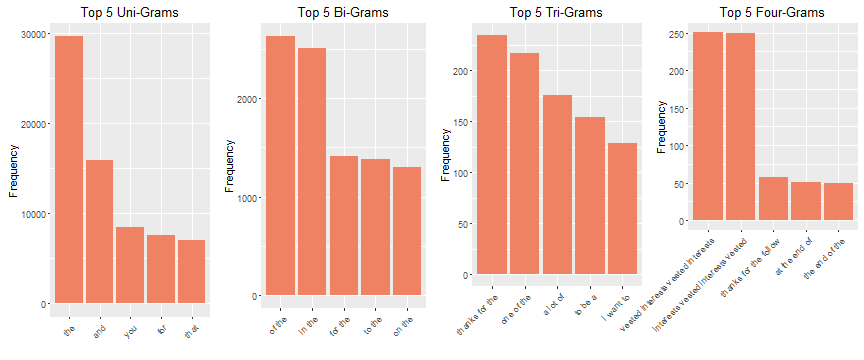
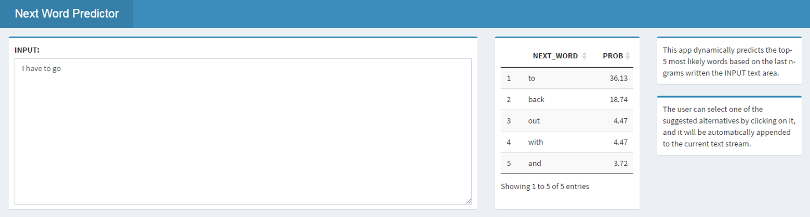

## Introduction

This presentation aims at explaining the procedure followed to build a NLP app that predicts the next word based on a a reference string (i.e. n-gram) as part of the Data Science Capstone.

[https://carubecas.shinyapps.io/nextWord/](https://carubecas.shinyapps.io/nextWord/)

The data set used for training consists of three text files ("en_US.twitter.txt", "en_US.blogs.txt" and "en_US.news.txt").


```
## [1] "So Tired D; Played Lazer Tag & Ran A LOT D; Ughh Going To Sleep Like In 5 Minutes ;)"
## [2] "Words from a complete stranger! Made my birthday even better :)"                     
## [3] "First Cubs game ever! Wrigley field is gorgeous. This is perfect. Go Cubs Go!"       
## [4] "I'm coo... Jus at work hella tired r u ever in cali"                                 
## [5] "The new sundrop commercial ...hehe love at first sight"
```

--- .class #id 

## Exploratory Analysis

* A sampling ratio of 1% have been selected.
* Raw data may include foreign characters, punctuation signs, and some other non-relevant elements that should be removed prior to tokenization.
* Tokenization is performed for uni-, bi-, tri- and four-grams. Non-frequent terms are removed before generating the dataframe. 



--- .class #id 

## Prediction Algorithm

Katz back-off is a generative n-gram language model that estimates the conditional probability of a word given its history in the n-gram. It accomplishes this estimation by "backing-off" to models with smaller histories under certain conditions. By doing so, the model with the most reliable information about a given history is used to provide the better results.

[https://en.wikipedia.org/wiki/Katz%27s_back-off_model](https://en.wikipedia.org/wiki/Katz%27s_back-off_model)

Check if the last 3 words written by the user are found in the first 3 words of the four-gram. 
 * In that case use the the most-likely last word of the four-gram as the predicted next word.
 * Otherwise move down to the tri-gram and repeat the process.

This process is performed again in the bi-grams and uni-grams if necessary.

--- .class #id 

## Shiny App
* This app dynamically predicts the top-5 most likely words based on the last n-grams written the INPUT text area.
* The user can select one of the suggested alternatives by clicking on it, and it will be automatically appended to the current text stream.

[https://carubecas.shinyapps.io/nextWord/](https://carubecas.shinyapps.io/nextWord/)


